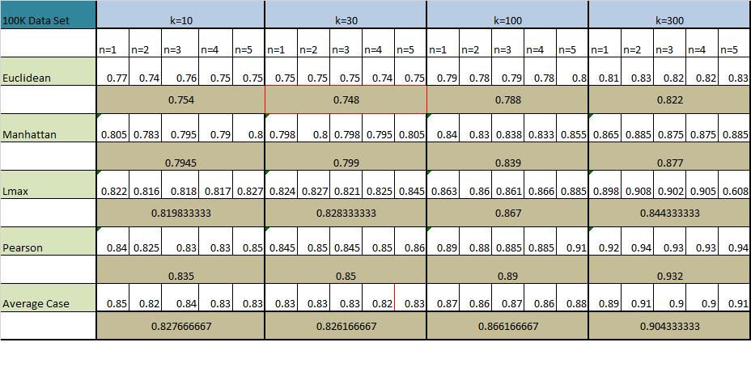

Recommendation System - Movielens
==============================================

### Project
Built a movie recommendation engine on movielens 100K dataset using collaborative filtering
and data mining algorithms.
(Assignment as part of B565 Course at Indiana University) 

  
### Details
Building a recommendation system.  
**(Sol)**  

Here i have shown the sequences of event through which i 
built the recommendation system.  

#STEP 1:
**Loding the Data**
Using the training sets i loaded all the data in python 
dictionary format i,e ${U:({m_{1}:R_{1}}....{m_{n}:R_{n}})}$
Here U is the user and $m_{1},m_{2}..m_{n}$ are movies he/she saw and $R_{1},..R_{2},...R_{n}$ are the ratings they gave to each movie.   
Similarily i created a master movie set of `movie_id:movie_name`   
$(m_{id}^1:m^1,....m_{id}^2:m^2)$   
 [code:load.py](./code/load.py)

Now once i stored the data in above format, i calculated the similarity between every two users.   

#STEP 2
**__Similarity Calculation__**  
-calculated similarity using four distance function Euclidean,Lmax,Manhattan and pearson correlation  
[code:similarity.py](./code/similarity.py)

#STEP 3 
**Making recommendation**    

**__Algorithm__:**  
*1.*for every person i am finding the list of every movie which he/she didnt watched.  
*2.*Then i am predicting that unseen movie rating by looking at how top k users of that particular person  who have seen that particular movie rated it.  
*3.*Using their ratings i am calculating user's predicted movie rating as: 
$$
\begin{aligned}  
Pr_{m}^U=(r_1 + r_2 ....+r_k)/k
\end{aligned}
$$

i,e mean rating of top k users for that movie.  
*4.*This step i repeat for every user for every movie  they haven't seen and finaly storing predicted movie rating of all such user in same format mentioned above   
[code:recEngineAlgo.py](./code/recEngineAlgo.py)

#STEP 4
**Calculation of MAD**:  
After running the recommendation engine , I calculated efficiency of my predictions using MAD as asked .    
[code:mad.py](./code/mad.py)
 

**(a)** Use the "100K Dataset" to evaluate three different distance metrics: the Euclidean distance,the Manhattan distance and the Lmax distance using the entire vectors of ratings over all movies.
Calculate the performance and find the best k from a hand-selected set of 3-5 values (your choice) for each specific case.  

*(Ans)*  
 
*Please note the original image is getting trimmed.Please look separately in file results_100.png to check results*  
[results](./images/results.png)

**observation**  
**1** Best MAD value is got was for Euclidean similarity for k=30.  
**2** A general trend i could figure out that MAD decreases if i increase K=10 to ~k=50 and then increases if i further increase k till 300.This should happen as if a increase K it should go towards average which is the worst case.   
**3** All similarity measure except pearson correlation performed better than Average case.    
**4** It took 100 iterations and almost 30+ hours to compute performance for all 5 Algorithms for 4 different K values and for 5 fold cross validation.  

**(b)** Continue with the "100K Dataset", but modify your distance metrics appropriately to incorporate other information such as user's gender, movie genre, etc. You should also at this stage change distance metrics into the ones you believe might perform better. For each new metric you tested,
explain the rationale for choosing it. It is not required, but you can also attempt one modification of the first principle of the recommendation system stated above (the algorithm itself).  

**(Algorithm)**:  
**1** Previously we were calculating similarity using only similar movies watched betweeen two users.  
**2** Now to incorporate other information in similarity calculation, i assigned weightage to  similar movies,gender,occupation,agegroup and calculated similarity for each parameter individually. So that final similarity 
$$
\begin{aligned}
s_{new}= w_{1}*s_{1}+w_{2}*s_{2}+w_{3}*s_{3}+w_{4}*s_{4}
\end{aligned}  
$$ 
I tried to alter combination of ${w_{1},w_{2},w_{3},w_{4},w_{5}}$    
Of all the combination i got best result(MAD=$0.74$) when i t Assign following weight to following parameters:  
$w_{1}$=similar movies=0.5  
$w_{2}$=Agegroup=0.2  
$w_{3}$=Gender=0.2  
$w_{4}$=occupation=0.1    
[code:Similarity.py](./code/similarity.py)    

**(c)** Switch to the "10M Dataset" and evaluate the performance of the top three algorithms you devised in the previous steps (this includes variations over distance functions and parameters).Note that here you will need to use the script to generate training and test partitions. Discuss your observations and Findings.  
**(Algorithm)**   
-First i ran the shell script to partion data into 5 fold.    
-After tremendous cleanin and standardizing files as per 100K dataset i ran above Algorithm i found till now which minimizes MAD to 0.74    
-Unfortunately since the code is implemented in python, it is taking unreasonable computing time.    
-I figured out scalibility issues with 10M million data set and clearly we need alter the algorithm to encorporate parallel computing and other paradigms like Map Reduce.   
-As per past observation, if the Algorithm would have run , i think i would have got better the person because of following reasons:    
1.More data to train on so better predictions on test data.    
2.Ratings in 10M data set are in decimals whereas in 100K it was in integer so the MAD 'll be significantly fall.      

**(d)**Briefly d comment on what might be a good next set of steps to improve this recommendation system.  
**(Algoritm)** There's lot of scope to improve the performance of this recommendation system as right now we implemented very basic similarity measure i,e Euclidean dist,Man Dist etc but as we'll study later in the course there's are lot of ways to calculate similarity based on clustering methods (K means,Knn).    
Further we could  used decision Tree to select most import demographic parameters responsible for movie predictions.  
There are numerous other complex algorithms  that could be used to implement recommendation system such as Naieve Bayes,Random Forest ..etc supplemented with boosting Algorithms to improve the efficiency  
Also to improve existing algorithm we could have predicted rating from top K users using following improved formula  by accounting similarity with each top K user.
$$
\begin{aligned}  
Pr_{m}^U=(s_1*r_1 + s_2*r_2 ....+s_K*r_k)/s_1+s_2...+s_k
\end{aligned}
$$

The whole recommendation engine can be run through [code:script.py](./code/script.py)
.Please note above script 'll only work if certain packages are preinstalled on the computer.  
All the code can be pull from my [github](https://github.com/Krish-Mahajan/Projects) account too. 
