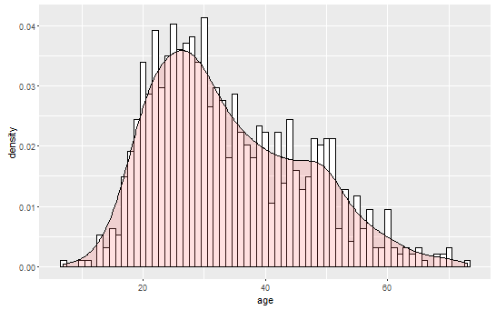

  
```{r c1,cache=TRUE,echo=TRUE,warning=FALSE,message=FALSE,error=FALSE,eval=FALSE}

library(plyr)

#reading Data and assiging colnames.
dataTbl <- read.table(file="./Data/ml-100k/u.data") 
colnames(dataTbl) <- c("user_id", "item_id", "rating", "timestamp")

#dropping timestamp column
dataTbl <- subset(dataTbl, select = -c(timestamp) )  

## preparing userTbl
userTbl <- read.table(file="./Data/ml-100k/u.user", sep =",")


#assign names to columns for ease of processing
colnames(userTbl) <- c("user_id", "age" , "gender","occupation", "zip_code")


#dropping zip code - decided not useful for me
userTbl <- subset(userTbl, select = -c(zip_code) 

                  
##preparing genreTbl - will be used later to fill in genre fields (rather than the numeric ID)
##"Childern's" quote character needs to be ignored
genreTbl <- read.table(file="./Data/ml-100k/u.genre", sep = "|", quote = "" )  


##preparing itemTbl
##URLS will mess up parsing due to use of quote charaters
itemTbl <- read.table(file="./Data/ml-100k/u.item", sep ="|", quote = "")  


#create vector used to assign names in for columns:
genreVect <- as.vector(genreTbl[["V1"]])  

#change Childern's to childerns to prevent errors
genreVect[genreVect %in% "Children\'s"] <- "Childrens"  


#assign names to columns for ease of processing
colnames(itemTbl) <- c(c("item_id", "movie_title", "release_date", "video_release_date", 
                       "IMDb_URL"), genreVect)  

#drop video_release_date (seems to not be filled) and URL from table
itemTbl <- subset(itemTbl, select = -c(IMDb_URL, video_release_date)) 
                  
#fix dates field
itemTbl$release_date <- as.Date(itemTbl$release_date, "%d-%b-%Y")  

##create unified table
#merge itemTbl
unifiedTbl <- merge(dataTbl, itemTbl) 
unifiedTbl <- subset(unifiedTbl, select = -c(item_id) )  


#merge userTbl and remove user_id
unifiedTbl <- merge(unifiedTbl, userTbl)

#turns out there are duplicate rows (rows with a unique user_id and movie title)
unifiedTbl <- unique(unifiedTbl)  


##function to create a single genre field, applying "multiple" to movies with 
##multiple genres because I may want the genre fields as a single variable for
##ease of processing
##function assumes x will contain a single factor/row
##intended use with ddply
createGenreFieldSingle <- function(x){
  #temporarally remove variables to make looping easier,
  tempDat <- subset(x, select = -c(user_id, rating, movie_title, 
                                   release_date, age, gender, occupation))  
  count <- 0
  genre <- "unknown" #unknown genre is default
  
  #some movies are have multiple rating from same user!
  #check if there are muliple rows in x
  if(nrow(x) > 1){
    #set tempDat to only have one row
    tempDat <- head(tempDat, n = 1)
  }
  
  for (i in names(tempDat)){
    if(tempDat[i] == 1){
      count <- count + 1
      genre <- i
    }
  }
  if(count > 1){
    genre <- "multiple"
  }
  names(genre) <- "genre"
  return(genre)
}

#will remove elements where user had voted twice for the same movie (THIS IS REALLY SLOW)
genreDat <- ddply(unifiedTbl, ~user_id + movie_title, createGenreFieldSingle)  


unifiedTblSingle <- merge(genreDat, unifiedTbl)   


#keep only stuff I need
unifiedTblSingle <- subset(unifiedTblSingle, select = 
                             c(user_id, movie_title, rating, genre,
                               release_date, age, gender, occupation) )

#output table as csv file
write.csv(unifiedTblSingle, "./Data/unifiedMLData.csv", row.names = FALSE)  


#create file with possible muliple files added

##function to create potentially multiple values or rows
##intended use with ddply
createGenreFieldMultiple <- function(x){
  #temporarally remove variables to make looping easier,
  tempDat <- subset(x, select = -c(user_id, rating, movie_title, 
                                   release_date, age, gender, occupation))  
  genreItem <- data.frame()
  
  #some movies are have multiple rating from same user!
  #check if there are muliple rows in x
  if(nrow(x) > 1){
    #set tempDat to only have one row
    tempDat <- head(tempDat, n = 1)
  }

  for (i in names(tempDat)){
    if(tempDat[i] == 1){
      genreItem<- rbind(genreItem,i)
    }
    genreItem<- rbind(genreItem, NA)
  }
  names(genreItem) <- "genre"
  return(genreItem)
}


unifiedTblMulti <- ddply(unifiedTbl, ~movie_title , createGenreFieldMultiple)


#remove all NA
unifiedTblMulti <- na.omit(unifiedTblMulti)

#clean and remerge
unifiedTblMulti <- merge(unifiedTblMulti, ddply(unifiedTbl, ~movie_title + user_id, 
                                                summarize, release_date))
unifiedTblMulti <- merge(unifiedTblMulti, unifiedTbl)

#some element re-added have no genre at all - removing from data
unifiedTblMulti <- unifiedTblMulti[unifiedTblMulti$genre != "1",]

unifiedTblMulti <- subset(unifiedTblMulti, 
                          select = c(user_id, movie_title, genre, rating,
                                     release_date, age, gender, occupation) )  


write.csv(unifiedTblMulti, "./Data/unifiedMLDataMulti.csv", row.names = FALSE)

```


```{r c2,cache=TRUE,echo=TRUE,warning=FALSE,message=FALSE,error=FALSE,eval=FALSE}


library(ggplot2)
library(plyr)
library(RColorBrewer)
library(grid)

# load single genre file
mlDat <- read.csv("./Data/unifiedMLData.csv")
mlDat$release_date <- as.Date(mlDat$release_date, "%Y-%m-%d") 

# load multi genre file
mlDat_multi <- read.csv("./Data/unifiedMLDataMulti.csv")


##Age Plot 

# prepare table for analysis of users
mlDat_user <- ddply(mlDat, ~user_id + age + gender + occupation, summarize, 
    mean_rating = mean(rating))
agePlot <- ggplot(mlDat_user, aes(age)) + geom_histogram(aes(y = ..density..), 
    binwidth = 1, colour = "black", fill = "white")
agePlot <- agePlot + geom_density(alpha = 0.2, fill = "#FF6666")
print(agePlot)
```
 
  

 
```{r c3,cache=TRUE,echo=TRUE,warning=FALSE,message=FALSE,error=FALSE,eval=FALSE}
## User Plot

# sorts by number of users
userPlot <- ggplot(mlDat_user, aes(x = reorder(occupation, occupation, function(x) -length(x)), 
    fill = gender)) + geom_bar()
# fix axis
userPlot <- userPlot + theme(axis.text.x = element_text(angle = 90, hjust = 1))
userPlot <- userPlot + ylab("number of users") + xlab("occupation")
# flip axis to make professions easier to read
userPlot <- userPlot + coord_flip()

ggsave(filename = "userPlot.pdf")

#Gender Plot
gender_dat <- ddply(mlDat_user, ~occupation, summarize, perc_male = (length(gender[gender == 
    "M"])/length(gender)), counts = -length(user_id))

# sorts by number of users
genderPlot <- ggplot(gender_dat, aes(x = reorder(occupation, counts), perc_male)) + 
    geom_bar(stat = "identity")
# fix axis
genderPlot <- genderPlot + theme(axis.text.x = element_text(angle = 90, hjust = 1))
genderPlot <- genderPlot + ylab("percent male") + xlab("occupation")
# flip axis to make professions easier to read
genderPlot <- genderPlot + coord_flip()

ggsave(filename = "genderPlot.pdf")  


##AgePlot
agePlot <- ggplot(mlDat_user, aes(x = reorder(occupation, occupation, function(x) -length(x)), 
    age)) + geom_violin()
# fix axis
agePlot <- agePlot + theme(axis.text.x = element_text(angle = 90, hjust = 1))
agePlot <- agePlot + ylab("age") + xlab("occupation")
# flip axis to make professions easier to read
agePlot <- agePlot + coord_flip()

# for plotting for age information
agePlot <- ggplot(mlDat_user, aes(x = reorder(occupation, occupation, function(x) -length(x)), 
    age)) + geom_violin()
# fix axis
agePlot <- agePlot + theme(axis.text.x = element_text(angle = 90, hjust = 1))
agePlot <- agePlot + ylab("age") + xlab("occupation")
# flip axis to make professions easier to read
agePlot <- agePlot + coord_flip()

ggsave(filename = "agePlot.pdf")


# for plotting rating trends
rankPlot <- ggplot(mlDat_user, aes(x = reorder(occupation, occupation, function(x) -length(x)), 
    mean_rating)) + geom_violin()
# fix axis
rankPlot <- rankPlot + theme(axis.text.x = element_text(angle = 90, hjust = 1))
rankPlot <- rankPlot + ylab("Average rating on Movies") + xlab("occupation")
# flip axis to make professions easier to read
rankPlot <- rankPlot + coord_flip()

ggsave(filename = "rankPlot.pdf")  

```

```{r c4,cache=TRUE,echo=TRUE,warning=FALSE,message=FALSE,error=FALSE,eval=FALSE}
# for printing figures adjacent to eachother
vplayout <- function(x, y) viewport(layout.pos.row = x, layout.pos.col = y)
grid.newpage()
pushViewport(viewport(layout = grid.layout(1, 4)))
print(userPlot, vp = vplayout(1, 1))
print(genderPlot, vp = vplayout(1, 2))
print(agePlot, vp = vplayout(1, 3))
print(rankPlot, vp = vplayout(1, 4))

```


