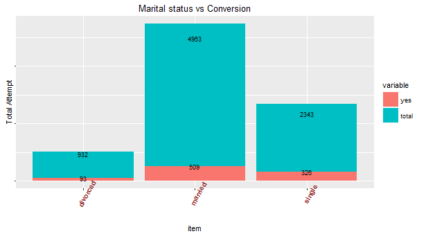
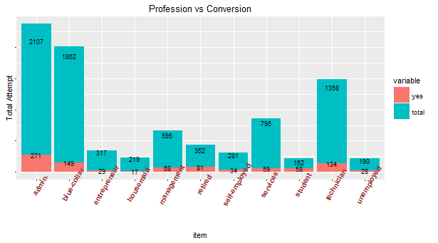
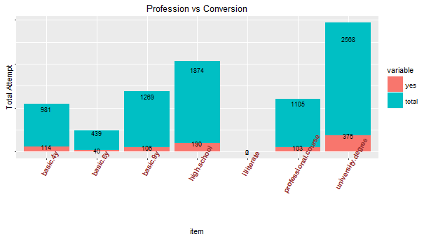
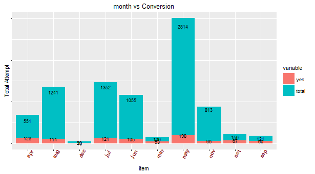

$$  
\begin{aligned}  
\textbf{Uptake Data Science Case Study}  
\end{aligned}
$$

$$  
\begin{aligned}
========================
\end{aligned}
$$

$$  
\begin{aligned} 
\textbf{Krishna Mahajan}   
\end{aligned}
$$

# Introduction:  

I followed standard data analytics practices & breaked down the case study in 
5 parts.  

**Data Treatment(Missing Value and outlier fixing)**    
**Descriptive/Exploratory Analysis of the Data**   
**Data Modeling**   
**Estimation of performance**      
**Final conclusion**   

 

The Data understanding part became very clear after going through each column in the data description provided.  
   

**Objective of the case study**  
Objective is to determine which set of customers the marketing firm should contact to maximize profit.  
The cost of marketing to a particular customer is $30. This cost is paid regardless of whether the customer responds to our marketing or not. 
Only if a customer responds to our marketing, company earn a profit.
Profit does NOT include the marketing cost. 

**Total Profit = Average profit per responding Customer * Number of customers responding - Number of customers to whom you marketed * $30**   

#Data Treatment  
Looking at the file training.csv ,i could figure out there were substantial NA values in many columns  as follows  

|                    | custAge | profession | marital | schooling | default | housing | loan | day_of_week | profit |
|--------------------|---------|------------|---------|-----------|---------|---------|------|-------------|--------|
| Total Missing      | 2014    | 71         | 10      | 2666      | 1618    | 184     | 184  | 787         | 7310   |
| Percentage missing | 24.45   | 0.86       | 0.12    | 32.36     | 19.64   | 2.23    | 2.23 | 9.55        | 88.74  | 

As can be seen in the above table, in the train DataSet only 88% of the Profit 
value's are NA which effectively means only 12% of the campaign positively responded  
For the profit column whoever not responsed i replaced thier profit as -$30 
as per the guidelines    
From this approach we can aggregate the total Profits as follows  

| Response | Profit  |
|----------|---------|
| Yes      | 159720  |
| No       | -219300 |  

Clearly the insurance company suffered loss overall(-59580) mainly because of targeting lot of customers.Thus there's dire need to optimize & customize which customers to target.   

**For the rest columns with NA values i imputed this missing values using MissForest package in R which is a popular implementation of  random forest algorithm.   
The rest of the columns has proportionally very less NA values so the imputation 
'll work fine**   

I used R to write code for imputation.  

[code:imputation code](./code/imputing.rmd)  

#Exploratory Analysis   
As a standard measure i performed univarate analysis of important categorical variables in the imputed data to try find their patterns with response variable.I felt 
stacked barplot could be the best visualization if the patterns are present.I got the following charts   

1). **Marital Status Vs response**    

  

2). **Profession Vs response**  

  

3). **Schooling Vs response**  

  

4).**Month vs Resonse**   

  

Looking at these charts, it is evident that none of the above categorical variable
is independently influencing the campaign outcome extremely.  

**So it wont be a good strategy to run campaign based on just one category.It is quite possible that past campaign were loss making because of this trend.**  

I used R for all the Visualization   
[code:exploratory_analysis.rmd](./code/exploratory_analysis.rmd)    

#Data Modeling  

Thus, from the exploratory Analysis it is quite clear that we need to take into account all the 21 variables to predict the response outcome.   

**Please note: Because the no. of features were not that much & all the features, are more or less naturally independent (For ex age,month,contact) so i refrained from using PCA or any dimension reduction techniques**  

Because the predictor variables were both categorical & numerical.So i used following modeling techniques  
1) Logistics Regression  classifier  
2) Random Forest Classifier  
3) Support Vector Machine  Classifier.     

To test the the accuracy of each of these classifier, i checked it on validation set , K fold Validation sets  as well Area under the curve(AUC) parameter.  

Following are the results i got : 

| Technique     | Validation Set | K Fold | AUC   |
|---------------|----------------|--------|-------|
| Logistic      | 0.90           | 0.89   | 0.800 |
| Random Forest | 0.89           | 0.90   | 0808  |
| SVM           | 0.901          | 0.90   | 0.782 |   

So on an average all the classifiers performed equally well on validation set as well as for K folds.  

Then,I tested each of this model on the file **testingCandidate.csv** to predict customer reponse. I got the following outcomes.  

| Technique     | Yes  | No    |
|---------------|------|-------|
| Logistic      | 906  | 31807 |
| Random Forest | 1720 | 31231 |
| SVM           | 1285 | 31666 |  

with 95% confidence interval. 

Thus logistics Regression comes out as most conservative classifier whereas
Random Forest is most optimistic.  

To make the final prediction i took the majority voting on each three of the classifier decision i,e if 2 or more classifiers are predicting that the customers 'll respond then i'll run campaign for that customer. If 1 or less classifier is predicting that the customers 'll respond then i'll not run campaign for that customer.  
The final results can be seen in the file **Final.csv**  
I used Python scikit learn to implement each of the three classifier.  

[code: Modeling code](./code/modeling.ipynb)   

#Conclusion.  

The final aggregated results of combined classifiers was to target
selected 1107 customers out of 33K customer base i,e 3%

so Projected Profit  

1) Most optimistics when all 1107 customers 'll respond  
**=Average profit per responding Customer*Number of customers responding - Number of customers to whom  marketed * $30** 
**= 171*1107 - 1107*30=$156087** 

2) Least optimistics when only 50% 0f 1107 selected customer response (less plausible)  
**=Average profit per responding Customer*Number of customers responding - Number of customers to whom  marketed * $30** 
**= 171*553 - 1107*30=$61438.5**  

Thus,By Targeting  above set of customers insurance company is very likely earn to significant profit even in the worst case scenario.I'll personally suggest insurance company to target around 5% of the total customers    

#Further Work.  
1). The above Analysis is very trivial given the time constraint.   
2). In future we can explore more of feature selection and sophisticated classifier's like neural networks to enhance our model.   
3). Exploratory Analysis/Descriptve Analytics could be more extensive to find more correlation and independence relationships among the features    
4). As per my experience i tried to implement Xtreme Gradient Boosting (XGB) for this problem for better accuracy on training data but somehow i couldn't implement it.     

#References  
1) www.r-blogger.com  
2)www.kaggle.com   
3)www.analyticsvidhya.com    

All the code & images can be found in code/image folder.   

#Skills Demonstrated  
1) R { ggplot,data.frame,data.table}
2) Python {scikit learn,numpy,Pandas,Jupyter notebook}       
3) Exploratory Data Analysis        
4) Machine Learning      
5) Business Understanding      

I tried my best to show all the required & Preferred skills for the concerned Data Science Programmer internship position.  